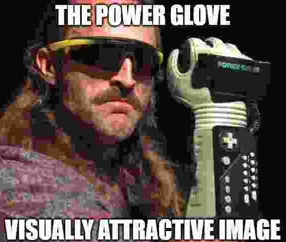
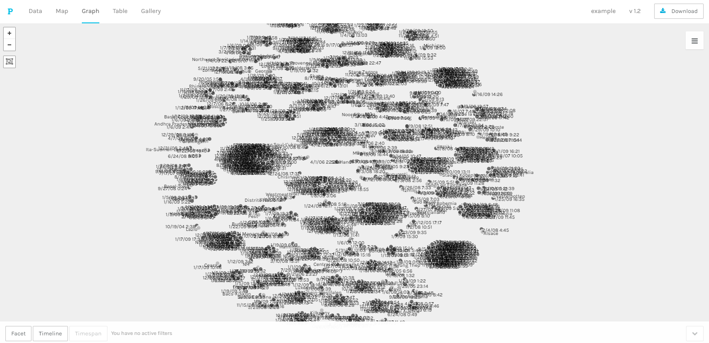
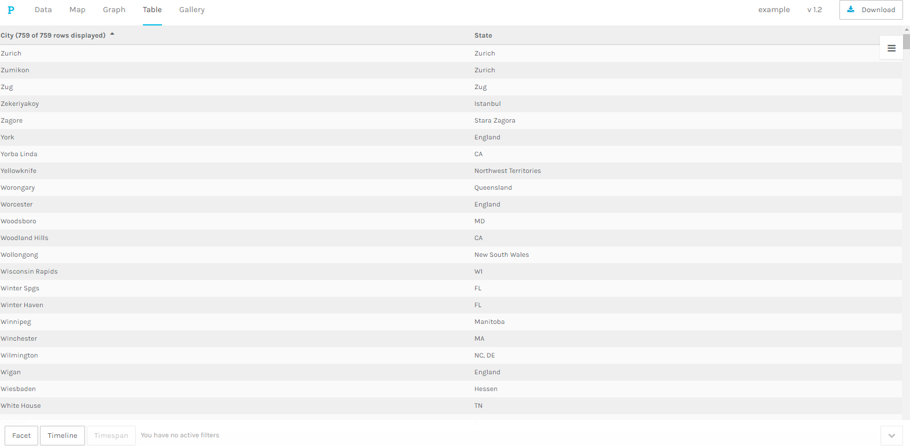

# IASC-2P02 Portfolio

Hi, My name is Connell Oliver I am a second-year student at Brock University. I am currently enrolled in the Interactive Arts and Science program and currently intend to complete the four-year honors degree. I am pursuing a specialization in the area of Geospatial Analysis. While much of the work I have performed in this class does not directly relate to this specialization it is noteworthy that throughout this document it should be noted the attention to patterning as well as general essential skills within this discipline will be evident within this portfolio. I intend on pursuing further involvement within the digital humanities and to complete a masters and culminate in a PhD within the digital humanities, at which point becoming a professor at an institution. At that point I will climb the ladder within the faculty’s hierarchy and become the president of that institution. At this stage of my work I would use the large resources at my disposal to influence both business and political organizations and individuals applying both my knowledge of digital technology and politics to influence the masses and the elite, this will clearly lead to my career progression as the puppet master of the world and is reasonably achievable career pathway within the digital humanities based upon my skills and abilities.

## The Power Glove

The project I have chosen to highlight was my presentation on the Nintendo Power Glove, the main points brought up within this presentation was for us as students to perform some media archeological research and determine a piece of technology that was forgotten or a failure and to see what kind of impact it did, and could have today if it was either real or had been a success. My main argument was that the power glove was as a concept, cutting edge and revolutionary however when it came down to production, marketing, and incorporation of this hot new piece of tech its legacy immediately became a stain upon the legacy of the lineage of wearable tech. the legacy of the power glove is of significant importance as it was the first true attempt at wearable aiming tech and subsequently the first major failure leading to game and tech developers to shy away from these technologies for quite some time and we are finally seeing cautious attempts by the industry today to move slower back towards the daunting goal they had initially set with the original Power glove. In regards to my research it was rather shocking the number of major blunders on the business side of this device’s production as by all accounts the ‘actual’ initially designed power glove performed admirably in testing, however reduced production quality and poor retrofitting of controls for the device resulted in its demise rather than a flaw in its concept.

[The Power Glove slideshow](https://carlthecactus.github.io/IASC-2P02/reveal/)

The project I have chosen to highlight was my presentation on the Nintendo Power Glove, the main points brought up within this presentation was for us as students to perform some media archeological research and determine a piece of technology that was forgotten or a failure and to see what kind of impact it did, and could have today if it was either real or had been a success. My main argument was that the power glove was as a concept, cutting edge and revolutionary however when it came down to production, marketing, and incorporation of this hot new piece of tech its legacy immediately became a stain upon the legacy of the lineage of wearable tech. the legacy of the power glove is of significant importance as it was the first true attempt at wearable aiming tech and subsequently the first major failure leading to game and tech developers to shy away from these technologies for quite some time and we are finally seeing cautious attempts by the industry today to move slower back towards the daunting goal they had initially set with the original Power glove. In regards to my research it was rather shocking the number of major blunders on the business side of this device’s production as by all accounts the ‘actual’ initially designed power glove performed admirably in testing, however reduced production quality and poor retrofitting of controls for the device resulted in its demise rather than a flaw in its concept.

Based upon the feedback given for the solo presentation, my format and individual slides meet expectation however it was lacking in key technical details and media archeological evidence. As such I improved upon the presentation by creating five slides each dedicated to the technical aspects of the device, such as the visual and marketing design of the product [here](https://github.com/carlthecactus/IASC-2P02/commit/873409b6cf6d5195904a84ec85122fb9007dc668#diff-890f068779e43beb317787310daafa5c)  which affects its public perception and first look of the consumer, then followed by a detailed explanation of the production of the Power glove which was one of the major downfalls of the item itself as the actually shipped product varied greatly in ability compared to the original prototype [here](https://github.com/carlthecactus/IASC-2P02/commit/a425f58f43f27c1c51dc545f3694a5b02351e877#diff-890f068779e43beb317787310daafa5c). Furthermore the technology which was revolutionary at the time was one of the slides that is of major importance that I have incorporated, not merely a regurgitation of the talking points earlier on in the presentation but an further in-depth explanation of what the devices inner components consisted of, while it may be a little technical I felt that the majority of people enrolled and educating within the digital humanities would recognize and understand a majority of the components and their functions within the technical explanation [here](https://github.com/carlthecactus/IASC-2P02/commit/9ed75438ee9f023bd940367c6106614fa11fcc30#diff-890f068779e43beb317787310daafa5c) of the device as it give a greater understanding to just how far the original prototype was pushing the boundary’s and expectations of wearable technology.

## group project

to see the presentation click [here](https://docs.google.com/presentation/d/1yaZbkcikFoIxXl-E5EmHkoj-OGK1jH4FrHXMuCH7YCM/edit#slide=id.g4f63bf794e_1_1539)

The tool we selected to research was the Palladio data visualization tool, this tool was utilized to produce visual representations based on raw data sets such as censuses and survey’s, we created a variety of representations of data from a census I had pulled from the internet about the housing market in New York state in 2008. We found that while Palladio had quite a bit to offer it had a step learning curve and was difficult for new users, but on the positive note Can showcase new connections in data previously unnoticed by the user and is both Interactive and fully customizable.

Within our group project we divided the necessary work into four equal parts, my component of the presentation was to perform testing within palladio, take screenshots and add them to the presentation. When it came to the actual presentation, I was to describe my findings, how I felt about the program and how these factors impact the functionality of the service. In general, as with the majority of assigned groupings this project was performed essentially as four individuals working towards a common goal yet still separately, I have noted in reflections before for core IASC courses that the communication in group projects is severely lacking and as such results in the work not being collaboratively produced as it was intended. As such it is difficult for me to note how collaboration has enriched my academic thinking as there was a distinct lack of collaboration taking place within my assign grouping. However, in regards to digital materials and workflow the usage of a shored google slide document did allow us to consolidate our individuals works into a passably presentable unified end product that was presented as a collaborative work. The only upside to our separated nature of teamwork was that we as a group were able to focus on our specific parts which allowed us to specialize in components of the Palladio system and explain them in detail as individuals rather than a collective, while this yields the disadvantage of a general understanding of the system it does allow a much greater depth and wealth of knowledge that was available to be presented in the end.

Deliverable 1: Large real estate data set sorted as clusters by name.

Deliverable 2: a representation of the data set in a graph style sorting by name.

Deliverable 3: this is a commit for the initial creation of the project file as the majority of the work I performed for this project was within the shared google slides page and does not appear on the commits list. However this commit is of the initial setting up of our groups repository branch as at the time I was the only member who understood (at a shallow level) how to make an initial page on GitHub and posted a link to the Palladio Wikipedia page so that my fellow group mates did not forget the topic we selected (as topic selection was left up to me).
[here](https://github.com/IascAtBrock/IASC-2P02-TeamPresentations/commit/f0939c0fdfd49fd49a86ea4f6384181980ff10f8)

## Academic blog

to see my academic blog click [here](https://carlthecactus.github.io/IASC-2P02/blog)
